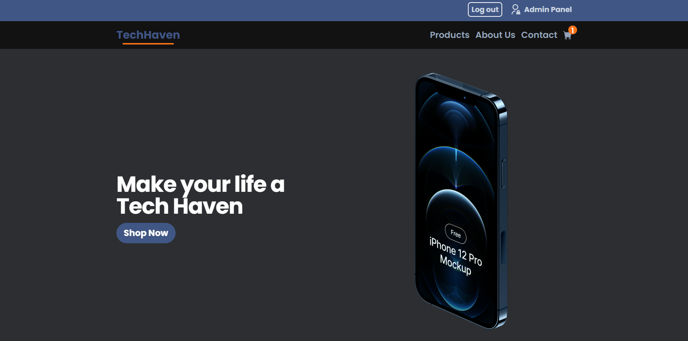
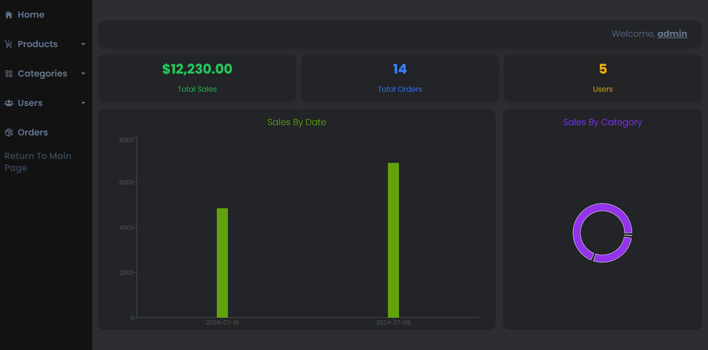
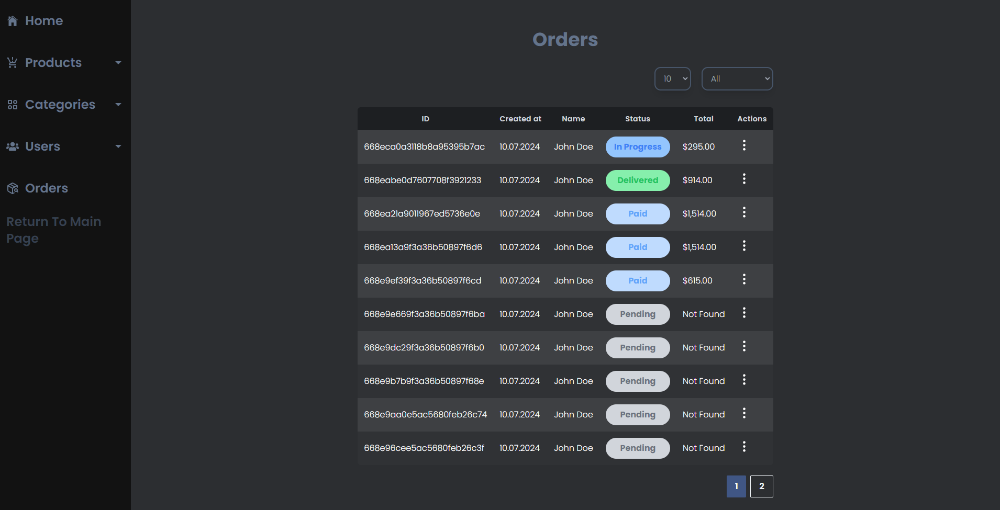

# Tech-Haven

Tech-Haven is a full-stack e-commrce web application developed using the MERN stack
(MongoDB, Express, React, Node). The Platform allows users to browse, search and purchase
tech products.

## [Link to Page](tech-haven-green.vercel.app)

## Few Images







## 🚀 Quick Start

1. Clone the repository

```
git clone https://github.com/synonim789/tech-haven.git
cd tech-haven
```

2. Install dependencies for both client and server

```
# install server dependencies
cd server
npm install

# Install client dependencies
cd ../frontend
npm install
```

3. Configure environment variables for server
   Create a '.env' file in the 'server' directory with the following content:

```
API_URL=version of your api for example api/v1
SECRET= random string
CLIENT_URL= link to client side
MONGODB_CONNECTION_STRING=connection string to mongoDB database
STRIPE_ENDPOINT_SECRET=secret to stripe webhook
STRIPE_KEY=api key from stripe
GOOGLE_BUCKET_NAME= name of google cloud bucket
GOOGLE_CREDENTAILS_BASE_64= transform google cloud service user json file to base64 and paste it in here
```

4. Configure environmental variables for client

```
VITE_SERVER_URL=url to server side
```

5. run server

```
npm run dev
```

Server will launch at localhost:3000

6. run cleint

```
npm run dev
```

Client will launch at localhost:5173
